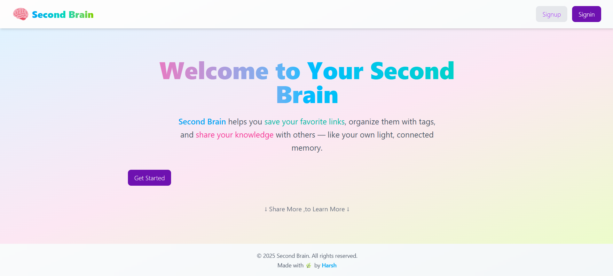
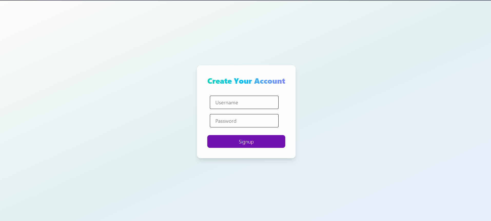
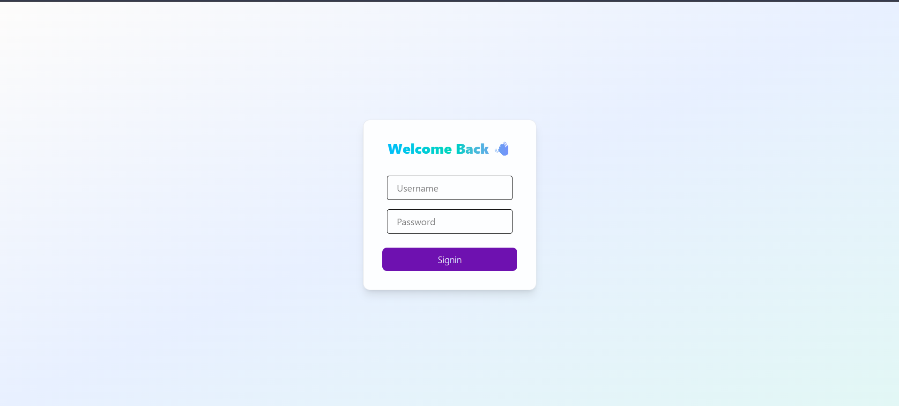
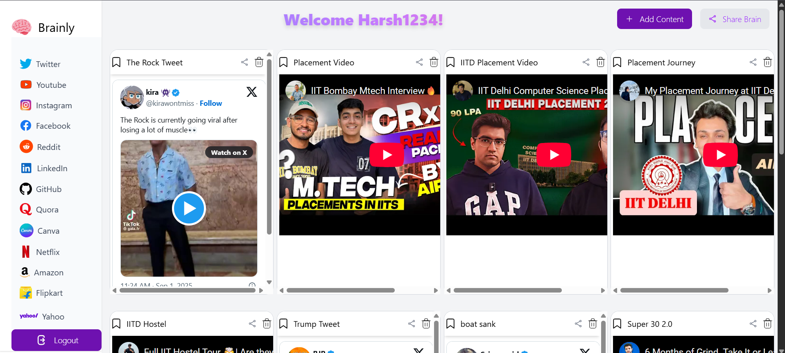
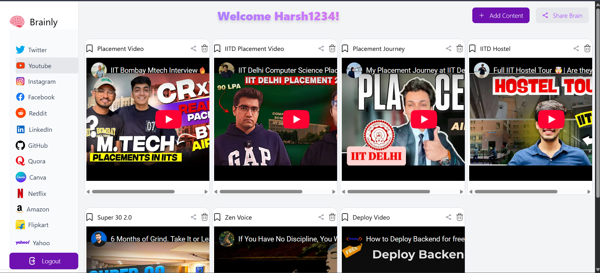

🧠 Second Brain

Second Brain is a link-sharing app where users can collect, organize, and share their favorite content from across the internet — videos, tweets, articles, or any web link.
It acts like your personal knowledge hub, but shareable with others.


✨ Features

🔗 Save Links – Add interesting links from YouTube, Twitter, Instagram, blogs, or any website.
🗑️ Delete Posts – Remove links whenever you want.
📂 Organize Dashboard – Manage all your saved content in one place.
📤 Share Dashboard – Share your collection with friends.
⚡ Fast & Responsive UI – Built with React + TailwindCSS.
🔒 Secure Backend– Node.js + Express + JWT authentication.

---

🖼️ UI/UX Preview  

🔹 Landing Page  
 

🔹 Sign Up Page  
 

🔹 Sign In Page  
  

🔹 Dashboard  
  

🔹 Filtered Content  
  


---

🛠️ Tech Stack

Frontend:

React 19
Vite
TailwindCSS
React Router

Backend:

Node.js (Express 5)
MongoDB + Mongoose
JWT Authentication
CORS enabled

---

⚙️ Installation & Setup

1. Clone the Repository

```bash
git clone https://github.com/yourusername/second-brain.git
cd second-brain
```

2. Install Dependencies

Frontend

```bash
cd frontend
npm install
```

Backend

```bash
cd backend
npm install
```

3. Setup Environment Variables

Create a `.env` file in backend:

```env
PORT=3000
MONGO_URI=your_mongodb_connection_string
JWT_SECRET=your_secret_key
```

For frontend, create `.env` or `config.js`:

```env
VITE_BACKEND_URL=http://localhost:3000/api/v1
```

4. Run the App

 Start Backend

```bash
cd backend
npm run dev
```

Start Frontend

```bash
cd frontend
npm run dev
```


---

📌 Folder Structure

```
second-brain/
│── frontend/       # React + Vite + Tailwind
│   ├── src/
│   ├── public/
│   └── package.json
│
│── backend/        # Express + MongoDB
│   ├── src/
│   ├── dist/
│   └── package.json
|
|──assets
│
└── README.md
```

🚀 Live Demo: [Will be added Soon after I am done with all the features!](https://your-app-link.vercel.app)


🤝 Contributing

Contributions are welcome! Feel free to fork this repo, submit issues, and open PRs.

---

📜 License

This project is licensed under the MIT License.
